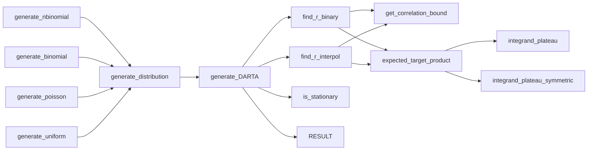

# DARTA

The DARTA model allows for the generation of autocorrelated random number series of desired discrete marginal distribution and autocorrelation structure, i.e. the pearson-autocorrelation can be dictated for any lag. It works by identifying a suitable stationary stochastic base process with marginal standard normal distribution and autocorrelation structure, which is used to generate a time-series following a standard normal distribution. This time-series is then transformed, via the inverse-transform-method, to a time-series with the desired marginal distribution and autocorrelation structure.

## Supported Distributions

DARTA has the capacity to approximate any provided discrete marginal distribution, but in the current version, specific support is provided for the following distributions: 
- **negative binomial distribution** 
- **binomial distribution** 
- **poisson diatribution** 
- **uniform distribution**

## Implementation

The model is implemented using the R programming language. It depends on a number of prerequisite packages, which need to be installed in order for the DARTA package to function. Following are the required packages:

-   **VGAM** (for bivariate normal distribution)
-   **r2r** (hashmap for caching)
-   **polynom** (for generating polynomial equation)
-   **mvtnorm** (to generate a multivariate normal distribution as starting point for the time-series generation)
-   **purrr** (to specify distribution parameters via partially applied functions)
-   **pracma** (for fitting a polynomial when using the 'interpol' method)

## Installation

If you have not already, install devtools package:

``` r
install.packages("devtools")
```

Then, simply install DARTA directly from the github-repository:

``` r
devtools::install_github("lsinfo3/DARTA")
```

You should now be able to use DARTA the same as any other package. Just load it into the Environment with the <code>library</code> function:

``` r
library(DARTA)
```

## Getting started

the [man/examples](man/examples) directory contains all currently available examples, which can also be found on the corresponding documentation pages.

## Code structure

``` bash
.
├── DARTA.Rproj
├── DESCRIPTION
├── LICENSE
├── man
│   ├── examples
│   │   └── 'generate_nbinomial'_example.R
│   ├── expected_target_product.Rd
│   ├── find_r_binary.Rd
│   ├── find_r_interpol.Rd
│   ├── generate_binomial.Rd
│   ├── generate_DARTA.Rd
│   ├── generate_distribution.Rd
│   ├── generate_nbinomial.Rd
│   ├── generate_poisson.Rd
│   ├── generate_uniform.Rd
│   ├── get_correlation_bound.Rd
│   ├── get_gamma.Rd
│   ├── get_poly_target_cached.Rd
│   ├── get_poly_target.Rd
│   ├── get_target_correlation.Rd
│   ├── get_target_val_cached.Rd
│   ├── integrand_plateau.Rd
│   ├── integrand_plateau_symmetric.Rd
│   └── is_stationary.Rd
├── NAMESPACE
├── R
│   ├── approximate_correlation.R   (Functions to approximate autocorrelation)
│   ├── DARTA.R                     (Core functionality, time-series generation)
│   ├── find_r_binary.R             (Find base autocorrelation structure by binary search)
│   ├── find_r_interpol.R           (Find base autocorrelation structure by interpolation from polynomial)
│   └── generate_distributions.R    (Accessible functions for predefined CDFs)
└── README.md
```

## Program flow
This diagram is meant to roughly visualize the program flow of the DARTA package, which can be helpful when tracing errors.



## Contact

If you have any questions, suggestions, or concerns, please raise an issue or contact [david.raunecker\@uni-wuerzburg.de](mailto:david.raunecker@uni-wuerzburg.de)
